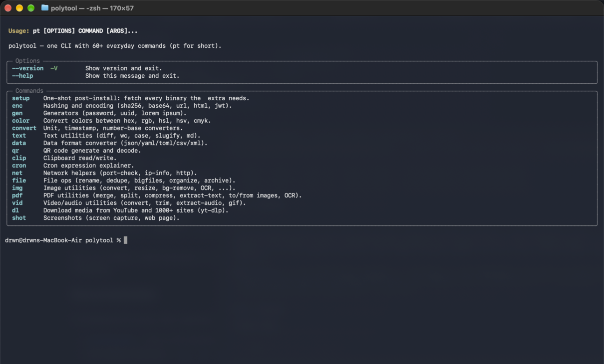
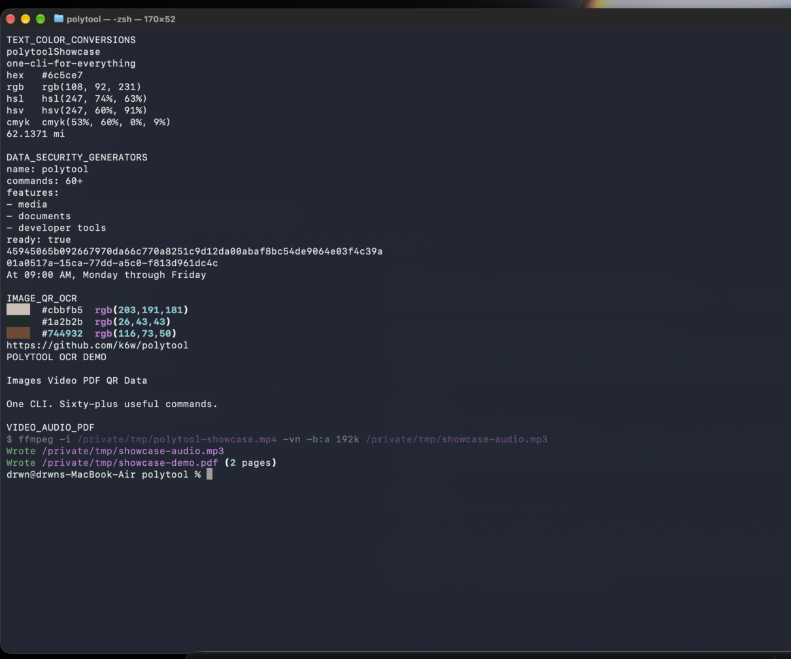
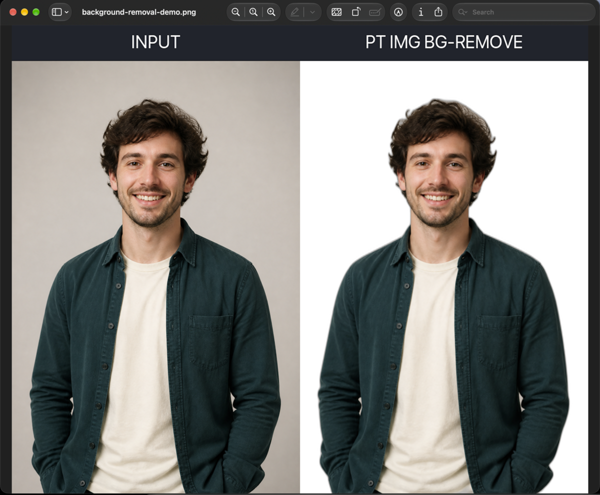
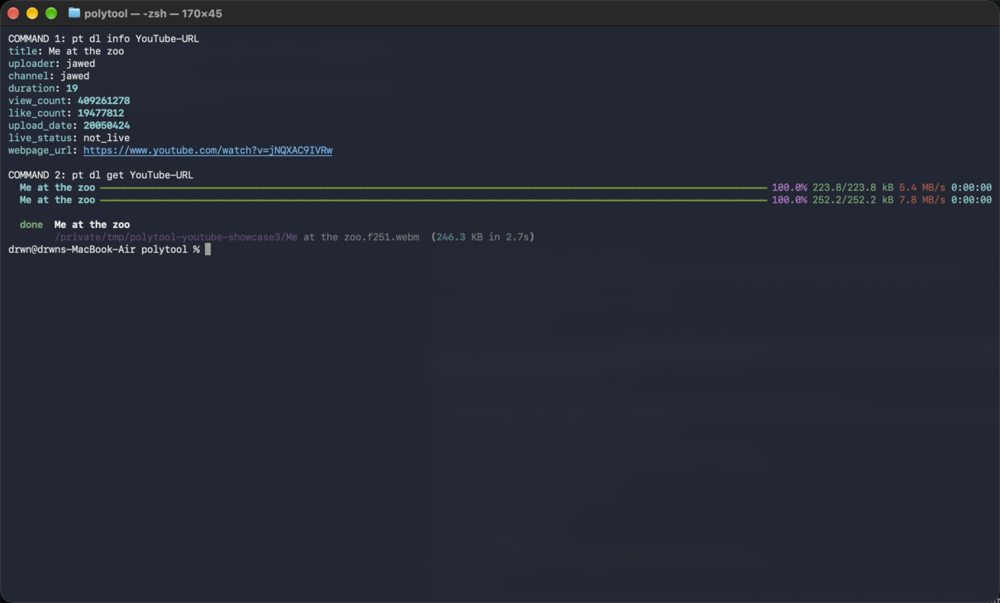

# polytool

**The command line toolbox for everything that is not worth installing another app for.**

`polytool` puts 60+ practical commands behind one memorable interface: `pt`. Convert
images, trim video, clean PDFs, remove backgrounds, run OCR, generate QR codes,
download media, transform data, hash files, inspect networks, and automate the
small tasks that normally turn into a tab-hunting expedition.

[](https://github.com/k6w/polytool/actions/workflows/ci.yml)
[](https://pypi.org/project/polytool/)
[](LICENSE)

## See the real thing

These are direct captures from the installed CLI and its generated artifacts—not
mockups or a web demo.



One Terminal window can handle text, color, units, data, security, generators,
images, QR, OCR, audio, and PDF work:



Real AI background removal, with the original and transparent result shown in Preview:



Live YouTube metadata and download through the `pt` wrapper:



## Why people reach for `pt`

- **One install, a broad surface.** Stop collecting tiny single-purpose utilities.
- **Discoverable by design.** Every command has focused help and runnable examples.
- **Pipelines-first.** Text commands use stdout; file commands choose sensible output names.
- **Fast startup.** Heavy dependencies load only when the relevant command runs.
- **Helpful failure modes.** Missing optional tools produce an actionable install hint.
- **Local by default.** Media, documents, data, hashes, and OCR stay on your machine unless a command explicitly accesses a network service.
- **Flexible footprint.** Install the lightweight core or opt into only the extras you need.

## Install in seconds

`uv` is the recommended installer because it manages Python and keeps the command isolated:

```bash
# macOS / Linux
curl -LsSf https://astral.sh/uv/install.sh | sh
uv tool install polytool

# Windows PowerShell
irm https://astral.sh/uv/install.ps1 | iex
uv tool install polytool
```

That gives you the fast core: data, encoding, generators, color, units, text,
QR generation, cron, networking, clipboard, and file operations.

For the complete toolbox:

```bash
uv tool install 'polytool[full]'
pt setup -y                 # install Deno and Chromium for external integrations
```

Both `polytool` and the shorter `pt` command are installed. PowerShell users
should keep the quotes around extras because brackets are shell glob characters.

## A five-minute tour

```bash
# Make a shareable QR code
pt qr gen "https://github.com/k6w/polytool" -o qr.png

# Prepare an image for the web
pt img convert photo.heic -o photo.jpg
pt img resize photo.jpg --width 1600
pt img compress photo.jpg --quality 75

# Turn media into something useful
pt vid gif clip.mp4 --width 480
pt vid extract-audio recording.mp4 -o recording.mp3

# Clean up documents
pt pdf merge cover.pdf report.pdf -o release.pdf
pt pdf to-images release.pdf --dpi 200

# Download public media and inspect it first
pt dl info 'https://www.youtube.com/watch?v=...'
pt dl get 'https://www.youtube.com/watch?v=...'

# Make data and developer chores boring
pt data convert config.yaml --to json
pt enc hash sha256 release.zip
pt enc base64 encode README.md
pt gen password --length 32
pt gen uuid v7
pt color convert '#3366ff'
pt convert unit '100 km' --to mi
pt text slugify 'Hello, World!'
pt cron explain '0 9 * * MON-FRI'
pt file dedupe ./Downloads
```

Run `pt --help`, then `pt <group> --help`. You can also pipe text into commands
that accept stdin and compose them with standard Unix tools.

## Everything inside

| Group | What it unlocks |
|---|---|
| `pt img` | Convert, resize, compress, watermark, palette, EXIF, ASCII, background removal, OCR |
| `pt vid` | Convert, trim, extract audio, animated GIF |
| `pt pdf` | Merge, split, compress, extract text, render, build from images, OCR |
| `pt dl` | YouTube and 1000+ site downloads, metadata, audio-only mode, browser cookies |
| `pt data` | JSON, YAML, TOML, CSV, XML conversion, pretty-printing, validation |
| `pt enc` | SHA/Blake2/xxhash, Base64, URL/HTML escaping, JWT decode and verify |
| `pt qr` | PNG, SVG, PDF, EPS, terminal, Wi-Fi QR generation, decode |
| `pt gen` | Passwords, UUID v1/v3/v4/v5/v7, lorem ipsum |
| `pt file` | Batch rename, duplicate detection, largest files, organizing, archives |
| `pt net` | Port checks, IP information, HTTP requests |
| `pt text` | Diff, word counts, case conversion, slugify, Markdown HTML/preview |
| `pt convert` | Units, timestamps, number bases |
| `pt color` | Hex, RGB, HSL, HSV, CMYK conversion |
| `pt cron` | Human explanations and next firing times |
| `pt clip` / `pt shot` | Clipboard operations and screen/web screenshots |

## Install only what you need

The base package stays intentionally small. Add capabilities à la carte:

```bash
uv tool install 'polytool[img]'          # Pillow, HEIC/AVIF/SVG, palette, ASCII
uv tool install 'polytool[vid]'          # ffmpeg-backed media conversion
uv tool install 'polytool[pdf]'          # PDF manipulation and rendering
uv tool install 'polytool[dl]'           # yt-dlp and matched EJS scripts
uv tool install 'polytool[shot]'         # mss and Playwright
uv tool install 'polytool[ai]'           # rembg background removal
uv tool install 'polytool[ocr]'          # Tesseract wrapper and EasyOCR
uv tool install 'polytool[qr-decode]'    # QR decoding (also needs native zbar)
uv tool install 'polytool[archive]'      # 7z support
```

`[full]` combines every extra. The first use of some commands also downloads
runtime assets: Deno for YouTube challenge solving, Chromium for web captures,
the U2-Net model for background removal, or language/model data for OCR.

Platform notes:

- macOS QR decoding: `brew install zbar`
- Debian/Ubuntu QR decoding: `sudo apt install libzbar0`
- macOS OCR: `brew install tesseract`
- Windows OCR: install Tesseract from UB Mannheim
- Video commands use a system `ffmpeg` when available and otherwise fall back to the bundled binary

If an optional dependency is missing, `pt` explains the exact extra to install.

## Trust the plumbing

The project is tested as a CLI, not only as a collection of importable functions:

- 143 automated tests covering happy paths, invalid input, integrations, and file outputs
- Ruff lint and formatting checks
- basedpyright static analysis
- Cross-platform CI configuration for macOS, Linux, and Windows
- Lazy imports so `pt --help` remains quick
- MIT licensed and straightforward to extend

## Documentation

Start with the [full command index](docs/README.md), or jump directly to:

[Install](docs/install.md) · [Images](docs/img.md) · [Video](docs/vid.md) ·
[PDF](docs/pdf.md) · [Downloads](docs/dl.md) · [Data](docs/data.md) ·
[Encoding](docs/enc.md) · [QR](docs/qr.md) · [Files](docs/file.md) ·
[Text](docs/text.md) · [Troubleshooting](docs/troubleshooting.md)

## Build from source

```bash
git clone https://github.com/k6w/polytool
cd polytool
uv sync --extra dev --extra img --extra vid --extra pdf --extra dl --extra shot --extra archive --extra qr-decode
uv run pytest
uv run ruff check .
```

Contributions use conventional commits (`feat:`, `fix:`, `docs:`, `test:`, and so on).
Every user-facing command should ship help examples, a happy-path test, and an
error-path test. See [architecture.md](docs/architecture.md) before adding a new group.

## License

MIT — see [LICENSE](LICENSE).
